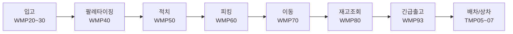
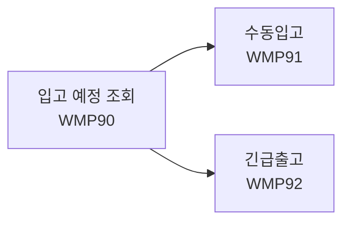
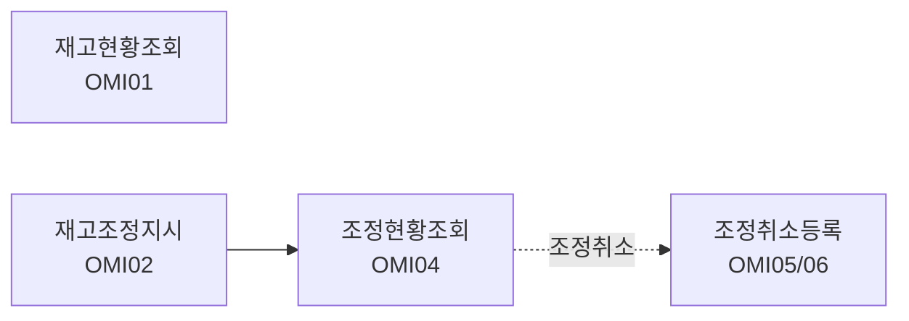

# 울산미포산단 스마트물류플랫폼 (US_DW)

현대자동차 부품 납품 창고 WMS 백엔드. PDA / 키오스크 전체 기능 개발 (첫 번째 프로젝트).

---

## 기술 스택

- **Backend**: Java 17, Spring Boot 2.6.3, MyBatis
- **DB**: MariaDB
- **Frontend**: Thymeleaf, JavaScript, PWA
- **Build**: Gradle (war)
- **Infra**: Docker, Jenkins

---

## 프로젝트 개요

| 항목 | 내용 |
|------|------|
| 기간 | 2023.07 ~ 2024.01 (약 6개월) |
| 팀 구성 | 런타임 6인 + 협력사 팀 |
| 담당 영역 | 6인 중 PDA / 키오스크 / OM 재고관리 단독 담당 |
| 도메인 | PDA / 키오스크 / 재고관리 |

---

## 참고 사항

- 이 저장소는 포트폴리오 목적으로 코드 구조와 구현 내용을 공개합니다.
- 실제 운영 환경과 분리되어 있고, DB 스키마/데이터 및 일부 상용 라이브러리가 포함되어 있지 않아 별도 환경 구성 없이는 직접 실행할 수 없습니다.
- 빌드 환경(참고): Java 17, Spring Boot 2.6.3, Gradle, MariaDB
- DB 접속정보 등 민감한 설정값은 `application.properties`에서 관리되며, 보안상 저장소에는 포함하지 않았습니다.

---

## 주요 기능

### PDA 전체 기능 개발

- Controller / Service / Mapper / HTML 전체 구현
- 바코드(ALC/QR) 스캔 분기 처리

### 키오스크 기능 개발

- 물리 키보드가 있어도 현장에서는 화면 터치로 입력해야 하는 상황이 많아, 가상키패드 도입
- 안전재고 알림
- offline 이벤트 감지 후 메인화면 리다이렉트
- PDA/키오스크 단말 홈 화면에 바로가기로 추가 시, 브라우저 주소창 없이 네이티브 앱처럼 보이도록 PWA manifest 구성 (별도 앱 설치 없이 현장 단말 배포)

### OM 재고관리 단독 개발

- 현업이 상황별로 빠르게 찾아야 하는 요구에 맞춰, 전체/부품별/로케이션별 3개 탭으로 분리 조회
- 낙관적 락(UPDTCHK 컬럼) 적용으로 동시 조정 충돌 방지

### 공통
- 커스텀 alert/confirm 공통 모듈
- PDA/키오스크는 창고별로 고정 배치되는 단말이라, 최초 설정 시 즐겨찾기 URL에 account_code만 지정해두면 이후 별도 로그인/창고 선택 없이 해당 창고 데이터만 바로 노출되도록 쿼리스트링 기반 멀티 창고 처리 구현

---

## 트러블슈팅

### 창고 와이파이 불안정 이슈
> PDA 저장 처리 시, 와이파이 불안정으로 응답 지연 및 저장 버튼 중복 클릭 발생 → offline 이벤트 감지 후 메인화면 리다이렉트 적용으로 동일 이슈 재발 없음

- **문제**: 현장 와이파이 불안정으로 저장 버튼 반복 클릭 시 오류 발생
- **해결**: offline 이벤트 감지 후 메인화면 리다이렉트 처리

### PDA 긴급출고 ALC/QR 케이스 누락
> PDA 긴급출고 시, QR코드만 처리되도록 구현되어 있어 ALC코드 입력 케이스 처리 불가 → 스캔 분기 처리 추가로 현장 클레임 없이 안정화

- **문제**: 현장 출장 중 현업 담당자에게 직접 확인하여 발견
- **해결**: ALC코드/QR코드 스캔 분기 처리 추가

### 재고조정 동시 접근 문제
> 재고조정지시 시, 동시 수정으로 인한 데이터 덮어쓰기(Lost Update) 우려 → UPDTCHK 컬럼 기반 낙관적 락 적용으로 사전 예방

- **문제**: 동시에 같은 재고를 조정하는 경우 데이터 충돌 우려
- **해결**: UPDTCHK 컬럼 기반 낙관적 락 적용
