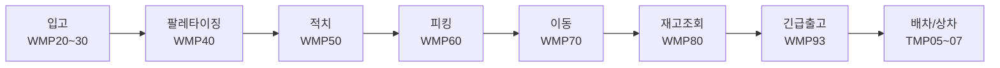
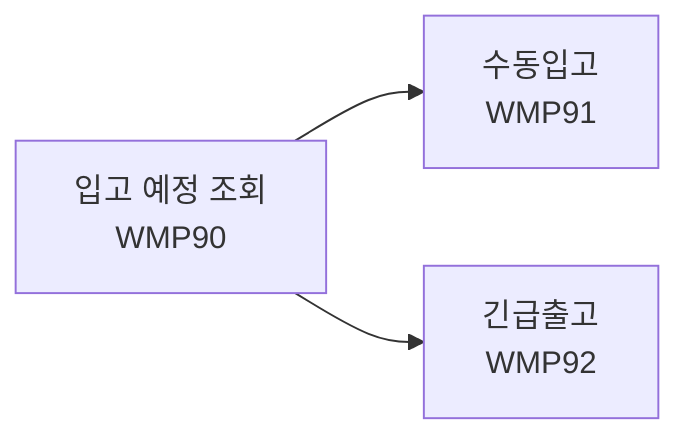
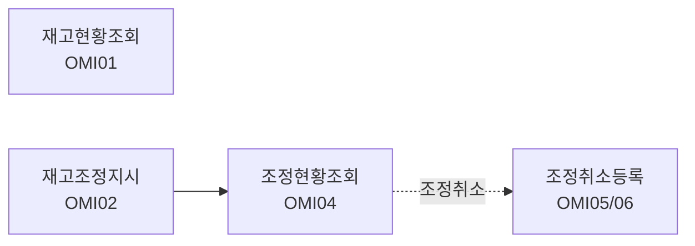

# 울산미포산단 스마트물류플랫폼 (US_DW)

현대자동차 부품 납품 창고 WMS 백엔드. PDA / 키오스크 전체 기능 개발 (첫 번째 프로젝트).

---

## 기술 스택

- **Backend**: Java 17, Spring Boot 2.6.3, MyBatis
- **DB**: MariaDB
- **Frontend**: Thymeleaf, JavaScript, PWA
- **Build**: Gradle (war)
- **Infra**: Docker, Jenkins

---

## 프로젝트 개요

| 항목 | 내용 |
|------|------|
| 기간 | 2023.07 ~ 2024.01 (약 6개월) |
| 팀 구성 | 런타임 6인 + 협력사 팀 |
| 담당 영역 | 6인 중 PDA / 키오스크 / OM 재고관리 단독 담당 |
| 도메인 | PDA / 키오스크 / 재고관리 |

---

## 요구사항

- Java 17
- Gradle (또는 내장된 gradlew 사용)
- MariaDB

---

## 실행 방법

```bash
git clone https://github.com/OhGwonSik/US_DW.git
cd US_DW

# application.properties.example을 참고하여 application.properties 생성 후 값 입력

./gradlew bootRun
```

---

## 주요 기능

### PDA 전체 기능 개발



- Controller / Service / Mapper / HTML 전체 구현
- 바코드(ALC/QR) 스캔 분기 처리

### 키오스크 기능 개발



- 가상키패드, 안전재고 알림
- offline 이벤트 감지 후 메인화면 리다이렉트
- PDA/키오스크 단말 홈 화면에 바로가기로 추가 시, 브라우저 주소창 없이 네이티브 앱처럼 보이도록 PWA manifest 구성 (별도 앱 설치 없이 현장 단말 배포)

### OM 재고관리 단독 개발



- 전체/부품별/로케이션별 탭 조회
- 낙관적 락(UPDTCHK 컬럼) 적용으로 동시 조정 충돌 방지

### 공통
- 커스텀 alert/confirm 공통 모듈
- account_code 쿼리스트링 기반 멀티 창고 처리

---

## 트러블슈팅

### 창고 와이파이 불안정 이슈
- **문제**: 현장 와이파이 불안정으로 저장 버튼 반복 클릭 시 오류 발생
- **해결**: offline 이벤트 감지 후 메인화면 리다이렉트 처리

### PDA 긴급출고 ALC/QR 케이스 누락
- **문제**: 현장 출장 중 현업 담당자에게 직접 확인하여 발견
- **해결**: ALC코드/QR코드 스캔 분기 처리 추가

### 재고조정 동시 접근 문제
- **문제**: 동시에 같은 재고를 조정하는 경우 데이터 충돌 우려
- **해결**: UPDTCHK 컬럼 기반 낙관적 락 적용

---

## 환경 설정

민감 정보는 `application.properties`에 관리되며 별도 제공되지 않습니다.

```properties
spring.datasource.hikari.logistics.jdbc-url=jdbc:mariadb://localhost:3306/us_dw
spring.datasource.hikari.logistics.username=
spring.datasource.hikari.logistics.password=
```
